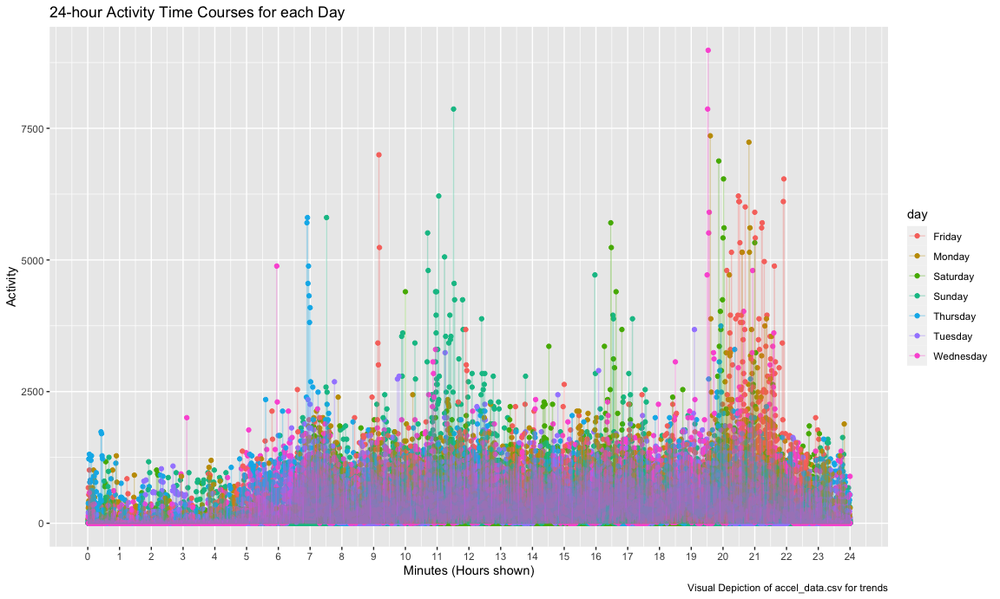

HW3
================
Niklas Hess
10/14/2022

# Problem 1

Omitted, as solutions are provided by Professor.

# Problem 2

#### First, I am loading and cleaning the data ahead of the next problems

    ## Rows: 35 Columns: 1443
    ## ── Column specification ────────────────────────────────────────────────────────
    ## Delimiter: ","
    ## chr    (1): day
    ## dbl (1442): week, day_id, activity.1, activity.2, activity.3, activity.4, ac...
    ## 
    ## ℹ Use `spec()` to retrieve the full column specification for this data.
    ## ℹ Specify the column types or set `show_col_types = FALSE` to quiet this message.

#### Second, I am calculating the activity totals and then dropping the individuals activity variables

``` r
aggregate_accel_df = accel_df %>%
  mutate(total_activity = rowSums(accel_df[,c(5:1444)])) %>%
  group_by(day_id) %>%
  relocate(week,day_id, day,weekend,total_activity) %>%
  select(1:5)

knitr::kable(aggregate_accel_df)
```

| week | day_id | day       | weekend | total_activity |
|-----:|-------:|:----------|:--------|---------------:|
|    1 |      1 | Friday    | Weekday |      480542.62 |
|    1 |      2 | Monday    | Weekday |       78828.07 |
|    1 |      3 | Saturday  | Weekend |      376254.00 |
|    1 |      4 | Sunday    | Weekend |      631105.00 |
|    1 |      5 | Thursday  | Weekday |      355923.64 |
|    1 |      6 | Tuesday   | Weekday |      307094.24 |
|    1 |      7 | Wednesday | Weekday |      340115.01 |
|    2 |      8 | Friday    | Weekday |      568839.00 |
|    2 |      9 | Monday    | Weekday |      295431.00 |
|    2 |     10 | Saturday  | Weekend |      607175.00 |
|    2 |     11 | Sunday    | Weekend |      422018.00 |
|    2 |     12 | Thursday  | Weekday |      474048.00 |
|    2 |     13 | Tuesday   | Weekday |      423245.00 |
|    2 |     14 | Wednesday | Weekday |      440962.00 |
|    3 |     15 | Friday    | Weekday |      467420.00 |
|    3 |     16 | Monday    | Weekday |      685910.00 |
|    3 |     17 | Saturday  | Weekend |      382928.00 |
|    3 |     18 | Sunday    | Weekend |      467052.00 |
|    3 |     19 | Thursday  | Weekday |      371230.00 |
|    3 |     20 | Tuesday   | Weekday |      381507.00 |
|    3 |     21 | Wednesday | Weekday |      468869.00 |
|    4 |     22 | Friday    | Weekday |      154049.00 |
|    4 |     23 | Monday    | Weekday |      409450.00 |
|    4 |     24 | Saturday  | Weekend |        1440.00 |
|    4 |     25 | Sunday    | Weekend |      260617.00 |
|    4 |     26 | Thursday  | Weekday |      340291.00 |
|    4 |     27 | Tuesday   | Weekday |      319568.00 |
|    4 |     28 | Wednesday | Weekday |      434460.00 |
|    5 |     29 | Friday    | Weekday |      620860.00 |
|    5 |     30 | Monday    | Weekday |      389080.00 |
|    5 |     31 | Saturday  | Weekend |        1440.00 |
|    5 |     32 | Sunday    | Weekend |      138421.00 |
|    5 |     33 | Thursday  | Weekday |      549658.00 |
|    5 |     34 | Tuesday   | Weekday |      367824.00 |
|    5 |     35 | Wednesday | Weekday |      445366.00 |

#### Third, I am showing the day activity to identify any interesting trends throughout the study period.

``` r
ggplot(aggregate_accel_df,aes(x = day_id, y = total_activity, color = weekend)) +
  geom_point() +
  geom_line() +
  labs(
    title = "Total Activity per day (for study period by week(end/day))",
    x = "Day ID",
    y = "Total Activity",
    caption = "Visual Depiction of accel_data.csv for daily trends"
    ) +
  scale_x_continuous(breaks = seq(0,35,by = 5)) +
  theme(plot.title = element_text(hjust = 0.5))
```


#### Fourth, I am converting the data to long-format, to be able to plot minutes by days

``` r
accel_longer_df = accel_df %>%
  pivot_longer(
    cols = activity_1:activity_1440,
    names_to = "minute",
    values_to = "activity",
    names_prefix = "activity_"
    ) %>% 
  mutate(minute = as.numeric(minute))
```

#### Firth (and last), I am plotting the long format of minutes and activity by day to show any daily trends throughout the week.

``` r
accel_longer_df %>%
  ggplot(aes(x = minute, y = activity, color = day)) +
  geom_point() +
  geom_line(alpha = .3) +
  scale_x_continuous(breaks = seq(0,1440,by = 60),
                     label = seq(0,24,by = 1),
                     limits = c(0,1440)) +
  labs(
    title = "24-hour Activity Time Courses for each Day",
    x = "Minutes (Hours shown)",
    y = "Activity",
    caption = "Visual Depiction of accel_data.csv for trends"
    )
```



# Problem 3

#### First, I load the data from the p8105.datasets

``` r
data("ny_noaa")
```

#### Second, I describe the Data

The data shows 7 variables (id, date, prcp, snow, snwd, tmax, tmin) from
New York state weather stations from January 1, 1981 through December
31, 2010. It has 2595176 obersvations. Key variables include id, which
denotes the weather station ID, and date, which indicates the date of
each subsequent observation. Since each weather station might not
collect all variables, missing data is a major issue in the context of
this data.

#### Third, I am cleaning the data ahead of the next problems

``` r
clean_noaa_df = ny_noaa %>%
  janitor::clean_names() %>%
  separate(date, into = c("year", "month", "day"), sep = '-') %>%
  mutate(month = as.numeric(month),
         year = as.numeric(year),
         month = factor(month.abb[month], levels = month.abb),
         tmax = as.numeric(tmax)/10,
         tmin = as.numeric(tmin)/10,
         prcp = as.numeric(prcp)/10)
```

#### Fourth, I calculate the Mode for Snow and describe the rationale in more detail

``` r
find_mode <- function(a) {
  value <- unique(a)
  tab <- tabulate(match(a, value))
  value[tab == max(tab)]
}
```

The most commonly observed values for snowfall are 0, which makes sense
because most of the year there is no snow-fall.

#### Fifth, I graph a two-panel plot showing the average max temperature in January and in July in each station across years

``` r
mean_max_temp = clean_noaa_df %>%
  filter(month == "Jan" | month == "Jul") %>%  
  group_by(id, year, month) %>% 
  summarize(mean_temperature = mean(tmax, na.rm = TRUE)) %>%
  ggplot(aes(x = year, y = mean_temperature, group = id)) +
  geom_line() +
  facet_grid(. ~ month) +
  labs(
    title = "Max temperature in January and in July in each station across years",
    x = "Years among weather stations",
    y = "Mean_Max_temperature",
    caption = "Data from ny_noaa") +
  theme(legend.position = "none")
```

    ## `summarise()` has grouped output by 'id', 'year'. You can override using the
    ## `.groups` argument.

``` r
mean_max_temp
```

    ## Warning: Removed 5640 row(s) containing missing values (geom_path).


Is there any observable / interpretable structure? Any outliers?

#### Sixth, I graph a two-panel plot showing tmax vs tmin for the full dataset

``` r
maxmin_plot = clean_noaa_df %>%
  ggplot(aes(x = tmax, y = tmin)) +
  geom_hex() +
  labs(title = "Max vs Min Temp over years",
       x = "Max Temp (C)",
       y = "Min Temp (C)",
       caption = "Data from NY NOAA.") +
  theme(legend.position = "left")

snowfall_plot = clean_noaa_df %>%
  filter(snow > 0, snow < 100) %>%
  ggplot(aes(x = snow, y = as.factor(year))) +
  geom_density_ridges(scale = 1) +
  xlim(0, 100) +
  labs(title = "Snowfall Distribution by Year (0-100 mm)",
       x = "Snowfall",
       y = "Year",
       caption = "Data from NY NOAA.")

maxmin_plot + snowfall_plot
```

    ## Warning: Removed 1136276 rows containing non-finite values (stat_binhex).

    ## Picking joint bandwidth of 3.76


