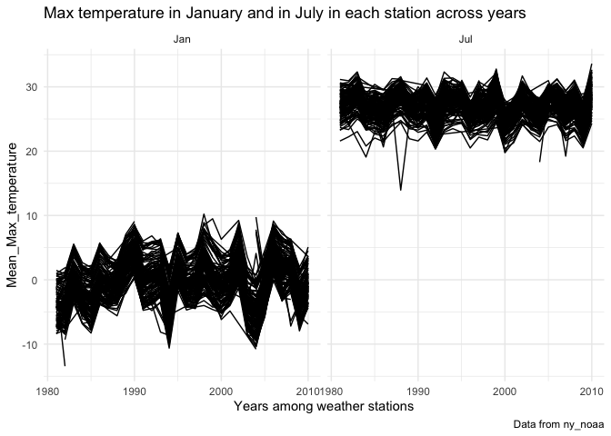

hw3
================
Niklas Hess
10/14/2022

``` r
library(tidyverse)
```

    ## ── Attaching packages ─────────────────────────────────────── tidyverse 1.3.2 ──
    ## ✔ ggplot2 3.3.6      ✔ purrr   0.3.4 
    ## ✔ tibble  3.1.8      ✔ dplyr   1.0.10
    ## ✔ tidyr   1.2.0      ✔ stringr 1.4.1 
    ## ✔ readr   2.1.2      ✔ forcats 0.5.2 
    ## ── Conflicts ────────────────────────────────────────── tidyverse_conflicts() ──
    ## ✖ dplyr::filter() masks stats::filter()
    ## ✖ dplyr::lag()    masks stats::lag()

``` r
library(patchwork)
library(ggridges)
library(p8105.datasets)
```

``` r
knitr::opts_chunk$set(echo = TRUE, 
                      warning = FALSE,
                      fig.width = 8,
                      fig.asp = 1,
                      out.width = "90%")

theme_set(theme_minimal() + theme(legend.position = "bottom"))
```

### Load the data from the p8105.datasets

``` r
data("ny_noaa")
```

### Data description

The data shows 7 variables (id, date, prcp, snow, snwd, tmax, tmin) from
New York state weather stations from January 1, 1981 through December
31, 2010. It has 2595176 obersvations. Key variables include id, which
denotes the weather station ID, and date, which indicates the date of
each subsequent observation. Since each weather station might not
collect all variables, missing data is a major issue in the context of
this data.

### Data cleaning.

``` r
clean_noaa_df = ny_noaa %>%
  janitor::clean_names() %>%
  separate(date, into = c("year", "month", "day"), sep = '-') %>%
  mutate(month = as.numeric(month),
         year = as.numeric(year),
         month = month.abb[month],
         month = factor(month, levels = month.abb),
         tmax = as.numeric(tmax),
         tmin = as.numeric(tmin),
         prcp = as.numeric(prcp))
```

The most commonly observed values for snowfall are 0mm, which makes
sense because most of the year there is no snow-fall.

### Two-panel plot showing the average max temperature in January and in July in each station across years

``` r
mean_max_temp = clean_noaa_df %>%
  filter(month == "Jan" | month == "Jul") %>%  
  group_by(id, year, month) %>% 
  summarize(mean_temperature = mean(tmax, na.rm = TRUE)) %>%
  ggplot(aes(x = year, y = mean_temperature, group = id)) +
  geom_line() +
  facet_grid(. ~ month) +
  labs(
    title = "Max temperature in January and in July in each station across years",
    x = "Years among weather stations",
    y = "Mean_Max_temperature",
    caption = "Data from ny_noaa") +
  theme(legend.position = "none")
```

    ## `summarise()` has grouped output by 'id', 'year'. You can override using the
    ## `.groups` argument.

``` r
mean_max_temp
```



Is there any observable / interpretable structure? Any outliers?

### Two-panel plot showing tmax vs tmin for the full dataset

``` r
maxmin_plot = clean_noaa_df %>%
  ggplot(aes(x = tmax, y = tmin)) +
  geom_hex() +
  labs(title = "Max vs Min Temp over years",
       x = "Max Temp (C)",
       y = "Min Temp (C)",
       caption = "Data from NY NOAA.")
```

``` r
snowfall_plot = clean_noaa_df %>%
  filter(snow > 0, snow < 100) %>%
  ggplot(aes(x = snow, y = year)) +
  labs(title = "Snowfall Distribution by Year (0-100 mm)",
       x = "Snowfall (mm)",
       y = "Year",
       caption = "Data from NY NOAA.")
```

``` r
maxmin_plot + snowfall_plot
```


